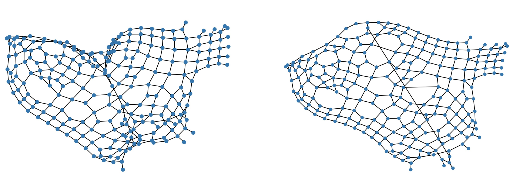

Graph Drawing using Edge Relaxation
==============================



The source code for replicating the experiments in *Graph Drawing using Edge Relaxation*.

Instructions
============

1. Install the requirements
```{bash}
make requirements
```
The dataset will be saved in `data/processed`.

2. Download, parse and save dataset
```{bash}
make data
```

3. Define hyperparameters for experiment
File `params1.json` in `src/experiments`:
```{json}
{
    "dataset_src": "data/processed/graph_ds-skewed",
    "k_relax": [0.025, 0.05, 0.1, 0.2, 0.3],
    "k_weight": [0.0, 0.05, 0.1, 0.5, 0.9],
    "patience": 20,
    "max_it": 100,
    "save_each": 20
}
```

4. Run experiment
```{bash}
make experiment expnum=1
```

> If `expnum=1`, then the file `params1.json` will be used.

The results can be found in `data/experiment_results` after the script finishes.


--------

<p><small>Project based on the <a target="_blank" href="https://drivendata.github.io/cookiecutter-data-science/">cookiecutter data science project template</a>. #cookiecutterdatascience</small></p>
